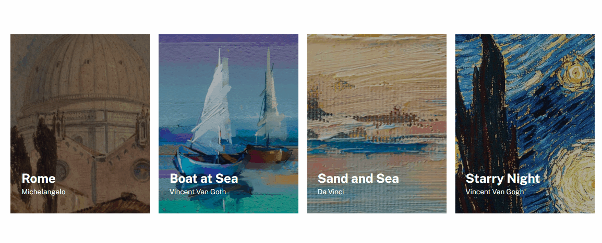

# Lista de Quadros com Flexbox

Projeto realizado com o objetivo de criar uma lista de quadros utilizando o Flexbox do CSS, feito para praticar as habilidades em layout responsivo e flexível.

## Objetivos

- Exibição de uma lista de quadros em um layout flexível.
- Responsividade para diferentes tamanhos de tela.
- Organização dos quadros em linhas e colunas utilizando Flexbox.

## Tecnologias Utilizadas

- HTML5
- CSS3

## Layout PC/Mobile

